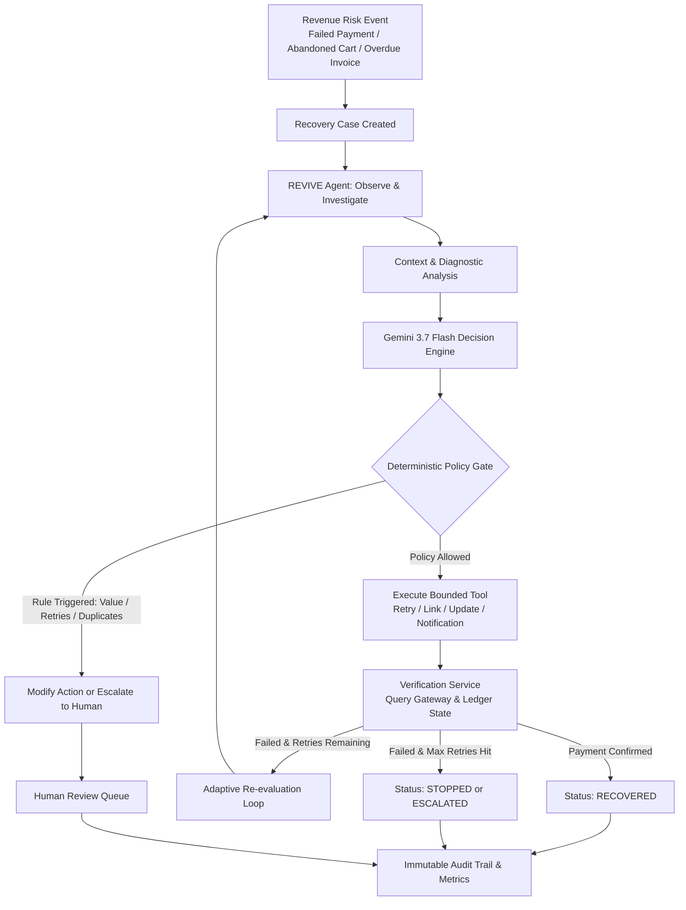

# REVIVE

### Autonomous AI Revenue Recovery Agent

REVIVE is a bounded-autonomy AI agent designed to identify revenue at risk, investigate underlying transaction context, and execute policy-cleared recovery actions within predefined safety guardrails.

Built for subscription businesses and modern checkout flows, REVIVE operates as an autonomous operational loop: detecting revenue loss events, diagnosing failure causes, formulating recovery strategies with LLM reasoning, validating every proposed action against zero-trust deterministic policies, executing bounded recovery tools, verifying financial outcomes, and adapting through iterative re-evaluation when initial attempts fail.

---

## The Problem

Subscription businesses and online merchants lose substantial recurring revenue to payment failures and checkout drop-offs:

- **Failed Subscription Payments**: Recurring billings fail due to transient gateway timeouts, soft declines (temporary insufficient funds), or hard declines (expired or stolen cards).
- **Checkout Abandonment**: High-intent shoppers reach payment stages but drop off due to payment gateway friction or session timeouts.
- **Overdue Invoices**: B2B and enterprise customers miss net-30/60 billing cycles without structured follow-up.

Traditional recovery workflows typically rely on **static dunning rules** (e.g., retrying failed cards every 24 hours regardless of error reason) or **manual human review**. Static rules repeatedly retry expired cards—leading to processor penalties and customer friction—while failing to adapt when a payment method is permanently dead.

The core challenge is not merely detecting that a payment failed. The challenge is determining:
1. **What specific recovery action should be taken** given customer history, risk tier, and error codes.
2. **Whether the action is safe and policy-compliant** before executing financial operations.
3. **Whether the executed intervention actually succeeded** through verified ledger and gateway checks.
4. **What alternative strategy to deploy if the initial attempt fails**.
5. **When an automated system must stop and escalate to a human operator**.

---

## The Solution

REVIVE replaces blind retries and disconnected scripts with a closed-loop, policy-governed recovery pipeline:

```text
Detect ──► Investigate ──► Decide ──► Policy Check ──► Act ──► Verify ──► Re-evaluate or Escalate
```

1. **Detect**: Ingests payment failures, overdue invoices, and abandoned checkout sessions into structured recovery cases.
2. **Investigate**: Gathers historical transaction records, customer lifetime value (LTV), previous retry counts, and churn risk scores.
3. **Decide**: Evaluates contextual signals using Google Gemini 3.7 Flash to formulate a reasoned recovery strategy with confidence scoring.
4. **Policy Check**: Passes the proposed strategy through a zero-trust deterministic policy engine that enforces financial limits, retry caps, and anti-looping safeguards.
5. **Act**: Dispatches the approved action using dedicated, bounded recovery tools (e.g., immediate retry, scheduled delay, payment link, credential update request).
6. **Verify**: Independently checks payment gateway and ledger state to verify whether revenue was captured.
7. **Re-evaluate or Escalate**: If the action fails and further retries remain viable, triggers an adaptive re-evaluation loop; if safety limits are hit or the case is high-risk, escalates directly to human revenue operators.

---

## Agentic Workflow

REVIVE is fundamentally distinct from simple chatbots, prompt chains, or passive LLM dashboards. It is an **action-oriented, autonomous agent** executing an operational state machine:

```text
Observe ──► Analyze Context ──► Select Action ──► Validate Policies ──► Execute Tool ──► Observe Outcome ──► Re-evaluate
```

- **Stateful Decision Loop**: The agent maintains execution state across multiple steps, tracking each action attempted, tool output received, and gateway response.
- **Bounded Tool Access**: The AI model has no direct database write permissions, shell access, or arbitrary API access. It operates strictly by requesting executions through a typed registry of 11 bounded recovery tools.
- **Adaptive Re-evaluation**: If an initial intervention fails (for example, an immediate retry returns an invalid payment method), the agent re-investigates the updated state, adjusts its diagnosis, and chooses a different recovery pathway (such as sending a secure payment method update link).
- **Deterministic Override**: The AI recommends actions, but a deterministic policy gate holds final veto power. An LLM cannot execute a financial transaction or customer communication unless the policy engine explicitly marks it as `ALLOW`.

---

## Supported Recovery Scenarios

REVIVE supports three primary revenue risk categories:

### 1. Failed Subscription Payment
- **Diagnosis**: Categorizes failures into transient network drops, soft declines (temporary insufficient funds), or hard declines (expired card, invalid token).
- **Agent Behavior**: Dispatches immediate retries only for transient network errors on reliable accounts; schedules off-peak retries for soft declines; immediately routes expired cards to payment method update flows rather than burning retries.

### 2. Checkout Abandonment
- **Diagnosis**: Identifies sessions where customers reached the payment stage with high intent but abandoned before completion.
- **Agent Behavior**: Generates time-limited, pre-populated payment links delivered via customer-preferred channels (Email, SMS, WhatsApp) to recover the transaction without requiring cart re-creation.

### 3. Overdue Invoice
- **Diagnosis**: Evaluates delinquent B2B invoices against contract terms, grace periods, and customer relationship tiers.
- **Agent Behavior**: Issues friendly automated reminders during grace periods; transitions to payment link generation and escalation when invoices exceed aging thresholds or value limits.

---

## How the System Works



---

## System Architecture

The REVIVE architecture cleanly separates analytical reasoning, policy enforcement, tool execution, and ledger persistence:

### Frontend Layer (`/src`)
- Built with **React 19**, **TypeScript**, and **Tailwind CSS**.
- Features an operations dashboard with 10 dedicated views:
  - **Overview Dashboard**: Executive recovery metrics, revenue at risk, and intervention rates.
  - **Recovery Cases**: Filterable tabular case inspector with context drawers.
  - **Live Agent Console**: Interactive node-by-node graph execution visualizer.
  - **Human Review Queue**: Dedicated escalation management interface for revenue operations.
  - **Policy & Guardrails**: Live policy rule configuration, threshold tuning, and violation telemetry.
  - **Evaluation Intelligence**: Benchmark harness comparing Baseline vs. AI Agent across ground-truth scenarios with CSV export.
  - **Simulation Lab**: Manual tool testing and scenario dispatch workbench.
  - **Analytics**: Churn cohorts, root-cause failure distributions, and recovery lift.
  - **Ground Truth**: Golden scenario catalog and inspection.
  - **Agent Decisions**: Historical trace of LLM rationales and confidence scores.

### Backend & API Layer (`server.ts`)
- Implemented in **Node.js** with **Express** and **TypeScript** (executed via `tsx` in development, bundled with `esbuild` for production).
- Provides type-safe REST APIs across `/api/recovery/*`, `/api/agent/*`, `/api/policy/*`, `/api/evaluation/*`, and `/api/simulator/*`.

### AI Decision Engine (`/database/engine/ai`)
- Powered by **Google Gemini 3.7 Flash** via the official `@google/genai` TypeScript SDK.
- Uses prompt versioning (`prompts.ts`) with strict system instructions and structured JSON response schemas.
- Incorporates automated confidence scoring: decisions falling below confidence threshold (0.70) automatically route to human review.
- Features **100% reliable deterministic fallback**: if the LLM API experiences downtime, rate limits, or parse errors, the engine falls back to rule-based strategy selection without halting operations.

### Agent Orchestration (`/database/engine/agent`)
- Implements a **LangGraph-inspired state machine** across 11 discrete nodes:
  `START` → `OBSERVE` → `INVESTIGATE` → `DIAGNOSE` → `STRATEGY_SELECTION` → `POLICY_GATE` → `EXECUTION` → `VERIFICATION` → `OUTCOME_EVALUATION` → (`RE_EVALUATE` loop or `END`).
- Coordinates state updates, step limits (maximum 3 iterations per case), and bounded tool calls.

### Policy & Guardrails Layer (`/database/engine/policy`)
- Deterministic, zero-trust rules evaluated prior to every execution step.
- Enforces financial protection limits, retry caps, customer communication quotas, and duplicate action blocks.

### Data & Repository Layer (`/database`)
- Manages 8 relational entities: `customers`, `subscriptions`, `payments`, `invoices`, `checkout_events`, `recovery_cases`, `recovery_actions`, and `audit_logs`.
- Implemented as an in-memory repository pattern (`DatabaseEngine` in `database/db.ts`) with PostgreSQL/Supabase-compatible relational schemas and migrations (`database/migrations/`).

### Audit & Verification Subsystems
- **Verification**: Dedicated validation tools (`check_payment_status`, `check_recovery_status`) that confirm actual state transitions rather than assuming tool execution equals success.
- **Audit Logging**: Cryptographically referenced, structured audit records capturing every agent step, input payload, tool output, policy verdict, and human-readable explanation card.

---

## Tech Stack

| Layer | Technology | Purpose |
| :--- | :--- | :--- |
| **Frontend** | React 19, TypeScript, Tailwind CSS, Motion, Lucide Icons | Real-time operations command center, interactive agent graph, and analytics |
| **Backend** | Node.js, Express 4.x, TypeScript (`tsx` / `esbuild`) | REST API server, orchestrator runtime, and static production file serving |
| **AI Decision Engine** | Google Gemini 3.7 Flash (`@google/genai` SDK) | Structured recovery strategy generation, risk analysis, and confidence scoring |
| **Agent Orchestrator** | LangGraph-inspired State Machine | Stateful 11-node cyclic recovery graph with bounded tool execution |
| **Policy & Safety** | Deterministic Policy Engine (TypeScript) | Zero-trust safety validation, financial limits, and escalation rules |
| **Data Layer** | In-Memory Relational Engine & Repositories | 8 domain repositories with schema migration scripts for PostgreSQL |
| **Simulation Lab** | Recovery Simulator Subsystem | Deterministic tool execution, transaction state mutation, and verification |
| **Testing & Benchmark** | TypeScript Benchmark Harness (`tsx`) | Repeatable ground-truth evaluation, comparison engine, and regression testing |

---

## Project Structure

```text
REVIVE/
├── database/                         # Core Backend Engine & Data Layer
│   ├── db.ts                         # In-memory relational database instance
│   ├── schema.ts                     # TypeScript entity interfaces and enum definitions
│   ├── migrations/                   # SQL migration scripts for relational persistence
│   ├── repositories/                 # 8 Typed data access repositories
│   ├── services/                     # Business services (dataService)
│   ├── simulator/                    # Recovery execution & state mutation simulator
│   ├── synthetic/                    # Deterministic data generator & ground-truth cases
│   └── engine/                       # Autonomous Recovery Engine Modules
│       ├── agent/                    # LangGraph workflow (graph, nodes, state, tools)
│       ├── ai/                       # Gemini advisory service, fallback, and prompts.ts
│       ├── policy/                   # Deterministic PolicyEngine, rules, and config
│       ├── evaluation/               # Benchmark evaluation engine and repository
│       ├── investigation.ts          # Customer profile and history gathering
│       ├── diagnosis.ts              # Error code mapping and root-cause analysis
│       ├── strategy.ts               # Strategy formulation interfaces
│       ├── execution.ts              # Action dispatch coordinator
│       ├── verification.ts           # Payment state verification
│       ├── outcome.ts                # Case resolution and ledger finalization
│       ├── metrics.ts                # Real-time recovery KPI calculations
│       └── RecoveryEngine.ts         # Deterministic pipeline coordinator
├── docs/                             # Architecture & Guide Documentation
│   ├── architecture.md               # Detailed architectural specification
│   ├── agent-workflow.md             # LangGraph state machine and node definitions
│   ├── data-flow.md                  # End-to-end data lifecycle specification
│   └── demo-guide.md                 # 3 live demonstration walkthroughs
├── scripts/                          # Automated Verification & Test Suites
│   ├── test_data_foundation.ts       # Repository and data foundation tests
│   ├── test_recovery_simulator.ts    # Simulator action and verification tests
│   ├── test_recovery_engine.ts       # Deterministic recovery pipeline tests
│   ├── test_ai_decision_engine.ts    # Gemini AI decision & fallback tests
│   ├── test_policy_guardrails.ts     # Policy guardrail rule tests
│   ├── test_agent_orchestration.ts   # LangGraph agent orchestration tests
│   └── test_evaluation_engine.ts     # Ground-truth evaluation benchmark tests
├── server.ts                         # Full-stack Express API server
├── src/                              # Modern React 19 Frontend
│   ├── components/                   # Navigation, layout, timeline, and status badges
│   ├── pages/                        # 10 Command center view pages
│   ├── services/                     # Frontend API client
│   ├── types/                        # Client-side TypeScript interfaces
│   ├── App.tsx                       # App shell and view routing
│   └── main.tsx                      # Frontend entry point
├── .env.example                      # Environment variable template
├── metadata.json                     # AI Studio application metadata
└── package.json                      # Build scripts and dependencies
```

---

## How the Agent Works

REVIVE enforces strict separation of responsibilities across its architectural components to guarantee bounded autonomy:

```text
AI Agent (Gemini 3.7) ──► Recommends strategy, confidence, and reasoning
         │
         ▼
Policy Engine         ──► Deterministically validates safety, limits, and permissions
         │
         ▼
Tool Registry         ──► Executes the approved recovery action
         │
         ▼
Verification Service  ──► Confirms actual payment capture on the ledger
         │
         ▼
Audit Subsystem       ──► Records an immutable, transparent execution log
         │
         ▼
Metrics Subsystem     ──► Quantifies recovered revenue, lift, and policy impact
```

- **AI Agent**: Analyzes diagnostic signals and recommends the optimal action. It has advisory authority only.
- **Policy Engine**: Determines whether the action is permitted based on hardcoded business rules, financial thresholds, and historical attempts.
- **Tools**: Execute the approved action against the payment simulator or gateway.
- **Verification Layer**: Confirms whether the payment actually succeeded rather than relying on tool dispatch confirmation.
- **Audit System**: Records an unalterable trail of inputs, decisions, policy checks, and outcomes for every step.
- **Metrics System**: Aggregates recovery KPIs to give operators immediate visibility into financial impact.

---

## Safety and Bounded Autonomy

The AI recommends actions, but deterministic policies control whether those actions can be executed autonomously. REVIVE enforces the following safeguards:

1. **High-Value Transaction Limit**: Any transaction or invoice with revenue at risk **>= ₹25,000 INR** is automatically intercepted and routed to the Human Review Queue for manual operator approval.
2. **Strict Retry Caps**: Immediate payment retries are strictly capped at **2 attempts**. Subsequent attempts are blocked or converted to scheduled delays or payment method update requests.
3. **Duplicate Action Prevention**: The agent cannot execute the same failing action consecutively on a case, preventing infinite dunning loops.
4. **Diagnosis Compatibility Protection**: Actions must match failure causes. The policy engine blocks blind retries on expired cards, requiring a payment method update instead.
5. **AI Confidence Threshold**: Recommendations with an AI confidence score **< 0.70** are automatically marked for human review.
6. **Customer Contact Quota**: Customer-facing notifications (Email/SMS/WhatsApp) are capped to prevent spamming delinquent accounts.
7. **Terminal State Idempotency**: Cases marked `RECOVERED`, `STOPPED`, or `CANCELLED` cannot have further actions executed against them.

---

## Data Environment

> **Testing Environment Note**: REVIVE currently operates using a **controlled synthetic evaluation environment** designed for reproducible demonstration, testing, and benchmark evaluation. It does not connect to live merchant production databases or execute real banking charges.

- **Synthetic Generator**: Houses 500+ deterministically seeded customer profiles (`seedData.ts`) with realistic Indian and international names, company designations, subscription tiers, lifetime values (LTV), card brands, and payment histories.
- **12 Golden Ground-Truth Scenarios**: Standardized test cases covering every common failure mode (transient network drops, expired cards, high-value enterprise accounts, abandoned checkouts, overdue loyal customers, max retry ceilings, unrecoverable churn, duplicate action traps, and AI fallback conditions).
- **Relational Integrity**: Maintains full foreign-key relational relationships across customers, subscriptions, invoices, payments, checkout events, and recovery cases.

---

## Performance Metrics

REVIVE measures financial recovery and operational safety using standard revenue metrics:

- **Revenue at Risk**: Total monetary value of delinquent invoices, failed subscription payments, and abandoned checkouts.
- **Verified Revenue Recovered**: Sum of funds confirmed captured through independent verification checks.
- **Revenue Recovery Rate**:
  $$\text{Revenue Recovery Rate} = \frac{\text{Verified Revenue Recovered}}{\text{Revenue at Risk}}$$
- **Recovery Success Rate**: Percentage of processed recovery cases successfully brought to `RECOVERED` status.
- **Policy Intervention Rate**: Percentage of AI-proposed actions modified, blocked, or escalated by safety guardrails.
- **Average AI Confidence**: Mean confidence score generated by Gemini across recovery decisions.
- **Multi-Step Recovery Lift**: Additional revenue captured through adaptive re-evaluation loops that would have failed under a single-shot retry rule.

---

## REVIVE vs. Baseline

REVIVE includes an integrated evaluation harness (`/database/engine/evaluation`) that benchmarks the autonomous agent against a standard **Deterministic Baseline**:

- **Baseline Approach**: Emulates conventional billing retry logic—retries failed payments once after a fixed interval, issues static notifications, and lacks context awareness or adaptive re-evaluation.
- **Evaluation Methodology**: Both the Baseline and REVIVE run against the exact same 12 Ground-Truth benchmark cases under identical simulated conditions.
- **Measured Outcomes**:
  - **Adaptive Recovery**: REVIVE recovers cases where the initial retry fails by diagnosing the failure and switching to alternative tools (such as payment links or card update requests).
  - **Zero Wasted Retries on Expired Cards**: The baseline repeatedly retries expired cards; REVIVE immediately routes them to credential update flows.
  - **100% Policy Compliance**: High-value cases (> ₹25,000) are safely escalated rather than blindly charged.
  - **Repeatable Benchmarking**: Results can be executed on demand from the UI and exported as CSV for auditing.

---

## Key Features

- **AI-Assisted Recovery Reasoning**: Context-rich decision formulation using Gemini 3.7 Flash with confidence scoring.
- **Policy-Controlled Autonomous Actions**: Zero-trust deterministic guardrails that prevent unauthorized financial actions.
- **Adaptive Multi-Step Workflows**: LangGraph-inspired state machine that re-evaluates and switches strategies when initial attempts fail.
- **Independent Outcome Verification**: Verifies payment settlement on the ledger before resolving cases.
- **Human-in-the-Loop Escalation**: Clean queue interface for high-value enterprise cases and low-confidence decisions.
- **Immutable Decision Audit Trail**: Detailed audit logs capturing every agent step, input, output, and policy verdict.
- **12 Ground-Truth Benchmark Suite**: Repeatable evaluation matrix comparing agent performance against static baselines with CSV export.
- **Full-Stack Architecture**: Modern React 19 frontend paired with an Express REST API backend in a unified TypeScript codebase.

---

## Demonstration Scenarios

Three standard walkthroughs demonstrate REVIVE's capabilities (see `docs/demo-guide.md` for detailed reproduction steps):

### 1. Successful One-Step Recovery
- **Scenario**: `GT_SUCCESSFUL_RETRY` (Case ID: `case_gt_001`, ₹2,499)
- **Flow**: A loyal customer experiences a temporary payment gateway timeout. The agent investigates account history, diagnoses a transient glitch, selects `RETRY_PAYMENT`, passes policy checks, executes the retry, verifies payment capture, and marks the case `RECOVERED`.

### 2. Adaptive Multi-Step Recovery
- **Scenario**: `GT_PAYMENT_METHOD_UPDATE` (Case ID: `case_gt_002`, ₹8,999)
- **Flow**: A subscription payment fails due to an expired card. Policy rules block blind retries. The agent adapts by dispatching a `request_payment_method_update` notification with a secure update portal. Once credentials update, the agent verifies and captures the payment.

### 3. High-Value Financial Safety & Escalation
- **Scenario**: `GT_HIGH_VALUE_ESCALATION` (Case ID: `case_gt_003`, ₹150,000)
- **Flow**: An enterprise invoice fails. While the AI may recommend retrying or generating links, the policy engine detects that revenue at risk exceeds ₹25,000 and immediately routes the case to the Human Review Queue for executive sign-off.

---

## Getting Started

### Prerequisites
- **Node.js**: `v18.0.0` or higher
- **npm**: `v9.0.0` or higher

### 1. Clone Repository
```bash
git clone https://github.com/your-username/revive.git
cd revive
```

### 2. Configure Environment Variables
Copy the environment template and configure as needed:
```bash
cp .env.example .env
```

To enable Gemini LLM decision-making, supply your Gemini API key in `.env`:
```env
GEMINI_API_KEY="your-gemini-api-key"
GEMINI_MODEL="gemini-3.7-flash"
```
*(Note: If no API key is provided, REVIVE automatically uses its built-in deterministic fallback engine, ensuring complete functionality without external credentials.)*

### 3. Install Dependencies
```bash
npm install
```

### 4. Run Automated Test Suites
Verify all subsystems before starting the server:
```bash
# Run all 7 test suites
npx tsx scripts/test_data_foundation.ts
npx tsx scripts/test_recovery_simulator.ts
npx tsx scripts/test_recovery_engine.ts
npx tsx scripts/test_ai_decision_engine.ts
npx tsx scripts/test_policy_guardrails.ts
npx tsx scripts/test_agent_orchestration.ts
npx tsx scripts/test_evaluation_engine.ts
```

### 5. Start Development Server
```bash
npm run dev
```
The application will start on `http://localhost:3000` (serving both the Express API and the React Vite development middleware).

### 6. Build for Production
```bash
npm run build
npm start
```

---

## Environment Variables

| Variable | Description | Default / Example |
| :--- | :--- | :--- |
| `PORT` | Server listening port | `3000` |
| `NODE_ENV` | Application runtime mode | `development` / `production` |
| `APP_URL` | Public URL of the application | `http://localhost:3000` |
| `GEMINI_API_KEY` | Google Gemini API Key | `""` (Uses fallback if blank) |
| `GEMINI_MODEL` | Gemini Model Identifier | `gemini-3.7-flash` |
| `AI_CONFIDENCE_THRESHOLD` | Confidence threshold below which cases escalate | `0.70` |
| `RECOVERY_STRATEGY_MODE` | Default decision provider | `deterministic` or `ai` |
| `PROMPT_VERSION` | Identifier for prompt versioning | `REVIVE_DECISION_V1` |
| `SUPABASE_URL` | Optional PostgreSQL / Supabase URL | `""` |
| `SUPABASE_ANON_KEY` | Optional Supabase Anonymous Key | `""` |

---

## Deployment

REVIVE is packaged as a container-ready full-stack Node.js application:

- **Frontend & Backend**: Bundled into a unified service where Express serves the compiled static React assets from `/dist` and routes `/api/*` requests.
- **Production Build**: Built with `vite build` and `esbuild server.ts --bundle --platform=node --format=cjs`.
- **Target Platform**: Optimized for containerized environments such as Google Cloud Run, deploying on port 3000.

---

## Documentation Links

For deeper technical specifications, refer to the documents in the `/docs` directory:

- [System Architecture Specification](docs/architecture.md) — Comprehensive architectural topology and subsystem breakdown.
- [Agent Workflow & State Machine](docs/agent-workflow.md) — LangGraph-inspired state machine, node transitions, and execution loops.
- [End-to-End Data Flow](docs/data-flow.md) — Complete data lifecycle from risk event ingestion to ledger verification.
- [Interactive Demo Guide](docs/demo-guide.md) — Step-by-step reproduction guide for the 3 primary evaluation walkthroughs.

---

## Future Roadmap

- [ ] **Live Payment Gateway Webhooks**: Direct webhooks for payment aggregators (Razorpay, Stripe) to trigger recovery cases on real transaction events.
- [ ] **Multi-Channel Provider Integrations**: Live SMS and WhatsApp Business messaging through providers like Twilio and Gupshup.
- [ ] **Cloud Database Persistence**: Direct connection to managed PostgreSQL / Supabase instances using the existing SQL migration scripts.
- [ ] **Enterprise Role-Based Access Control**: Multi-tenant authentication and permission tiers for finance managers, agents, and auditors.
- [ ] **Predictive Churn Preemption**: Early warning models analyzing payment failure warning signals prior to billing dates.

---

## License

MIT License. Developed for autonomous revenue recovery research and development.
